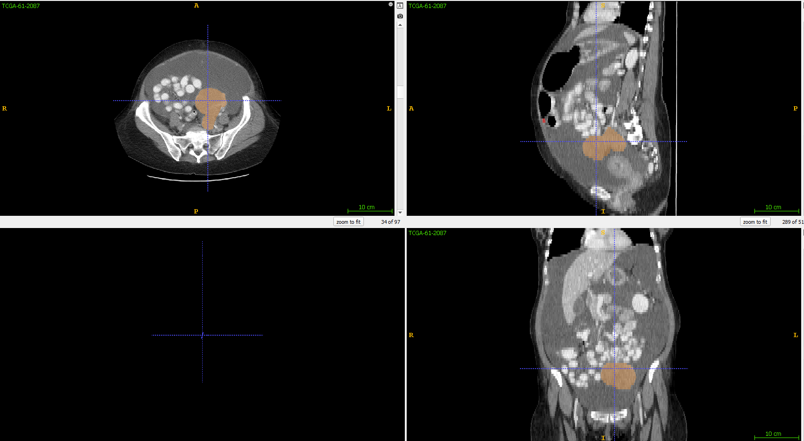

A deep learning based library for segmentation of high grade serous ovarian cancer on CT images.
The library contains the code and the finals models created during my [PhD Thesis](https://doi.org/10.17863/CAM.87940) some of which have been described in our [paper](https://eurradiolexp.springeropen.com/articles/10.1186/s41747-023-00388-z).

While the code was mostly used for ovarian cancer segmentation, the library is general purpose and can be used to train other kind of segmentation models. In case you have questions you can send a mail to me: thomasbuddenkotte@googlemail.com

The code design is in some ways simliar to the nnU-Net library (https://github.com/MIC-DKFZ/nnUNet). Many thanks to the authors for sharing their code and letting me learn from it.

# Installation

Before you install the library make sure that your machine has a CUDA compatible GPU.
To install ovseg simply clone the repo and install via pip:

```
git clone https://github.com/ThomasBudd/ovseg
cd ovseg
pip install .
```

# Inference

We've recently updated the library to make the inference usage of it more convenient. To run inference you need to provide the data in the nifti format (as either .nii or .nii.gz file). We recommend to check your nifti images with the [ITK-SNAP](http://www.itksnap.org/pmwiki/pmwiki.php) viewer to see if the images have the correct orientation. The results will contain errors in case the axial, sagittal or coronal views are swapped. The correct orientation looks like this:



In case your image data is stored as dicom files, you can use a tool like [this](https://github.com/icometrix/dicom2nifti) one for conversion and check the results with ITK-SNAP as described above.

Now you can call the inference from the terminal/command line by providing the path to the folder in which all nifti images are stored:

> ovseg_inference path_to_data 

If you prefer write python code directly you can also do this with a small script:

> from ovseg.run.run_inference import run_inference
> run_inference("\PATH\TO\DATA")

In case you want to run the inference only on a single image you can also provide the path to that image instead. By default the code will run the inference for the model segmenting the pelvic/ovarian and omental disease. If you want to use other models specific them in the command above with the --models specifier on the command line or the "models=[...]" argument of the python function. Available models are

- pod_om: model for main disease sites in the pelvis/ovaries and the omentum. The two sites are encoded as 9 and 1 in the predictions.
- abdominal_lesions: model for various lesions between the pelvis and diaphram. The model considers lesions in the omentum (1), right upper quadrant (2), left upper quadrant (3), mesenterium (5), left paracolic gutter (6) and right  paracolic gutter (7).
- lymph_nodes: segments disease in the lymph nodes namely infrarenal lymph nodes (13), suprarenal lymph nodes (14), supradiaphragmatic lymph nodes (15) and inguinal 
lymph nodes (17).

you can also combine the models to run two or all three at the same time. Lastly, you have the option to run the inference in fast mode using the --fast option of the command line tool or the argument "fast=True". This drastically decreases the computation time at the cost of accuracy. This option was mainly build to try and run the code on a local machine that does not have a GPU. On my laptop this took ~13 mins per image. The results will be stored as nifti files, you can use ITK-SNAP to take a look at them.

The code will download the network weights automatically and store them in the clone git repository. In case you want to store them somewhere else you have to set up an environment variable called OV_DATA_BASE and specify the desired location.

# Training

Before you can run training we recommend to set up an environment variable called OV_DATA_BASE.
All predictions, (pre-)trained models, raw data, etc. will be stored in this location. By default the code will set it to the folder of the cloned git repository of this code.
If you're planning to run training on a multi-server system it is advised to set up the OV_DATA_BASE at a central location all servers can access (see run training).

# Data management

To run inference or training you first need to store the datasets in a particular way to make it accessible for the library. All datasets should be stored at $OV_DATA_BASE\raw_data and should be given a unique name. Currently the library supports datasets in which images (and segmentations) are stored as nifti or dicom files. In this current version only single channel images were tested.

If you're using **nifti files** create a folder called 'images' in $OV_DATA_BASE\raw_data\DATASET_NAME and simply put all images in there. In the case of training create a second folder called 'labels' with the corresponding segmentations. The segmentation files should have the same names as the image files or follow the Medical Decathlon naming convention (image: case_xyz_0000.nii.gz, seg: case_xyz.nii.gz). For example

	OV_DATA_BASE/raw_data/DATASET_NAME/
		├── images
		│   ├── case_001_0000.nii.gz
		│   ├── case_002_0000.nii.gz
		│   ├── case_003_0000.nii.gz
		│   ├── ...
		├── labels
		│   ├── case_001.nii.gz
		|   |── case_002.nii.gz
		│   ├── case_003.nii.gz
		│   ├── ...
   

For **dicom images** any type of folder structure is allowed. Make sure that only axial reconstructions are contained in your dataset, the code won't remove other types of reconstructions such as topograms or sagital slices by itself. The code also assumes that all dicoms found in one folder belong to the same reconstruction, make sure that each reconstruction is contained in a seperate folder. If you're performing training, include the segmentations as dicomrt files. Each folder with reconstruction dicoms should have exactly one additional dicomrt file with the corresponding segmentation. Missing segmentations are interpreted as empty segmentations masks (only backgorund).

Examples are

	OV_DATA_BASE/raw_data/DATASET_NAME/
   		├── patient1
    	│   ├── segmentation.dcm
    	│   ├── slice1.dcm
    	│   ├── slice2.dcm
    	│   ├── slice3.dcm
    	│   ├── ...
    	├── patient2
    	│   ├── ...
    	├── patient3
    	│   ├── ...
    	├── ...


Or

	OV_DATA_BASE/raw_data/DATASET_NAME/
   		├── patient1
    	│   ├── timepoint1
    	|   │   ├── segmentation.dcm
    	|   │   ├── slice1.dcm
    	│   |   ├── slice2.dcm
    	│   |   ├── slice3.dcm
    	│   |   ├── ...
    	│   ├── timepoint2
    	│   |   ├── ...
    	├── patient2
    	│   ├── ...
    	├── patient3
    	│   ├── ...
    	├── ...

Or a mixture of the above. Note that it is not necessary to rename your dcm files to "segmentation.dcm" or "sliceX.dcm", the library will recognise it automatically.

# Rerun ovarian cancer segmentation training

Repeating ovarian cancer segmentation can be done via command line without changing any pthon code. Before the training can be started the raw data has to be preprocessed and stored. If you're running the training on a multi-sever system it is advised to place the OV_DATA_BASE in a central storage. However, this is not a good place for preprocessed data. The preprocessed data should be kept on a fast local disk to ensure that loading times do not become a bottleneck of the training. In this case create a second environment variable called OV_PREPROCESSED that is located on such fast local disk. If this variable is not created, the preprocessed data will be simply stored at $OV_DATA_BASE/preprocessed.

To perform preprocessing call the script 'preprocess_ovaraian_data.py' with the name of all datasets you want to use for training as arguments. For example
> python preprocess_ovarian_data.py DATANAME1 DATANAME2

Next the training can be started by running 'run_training.py'. The first input needed is the number of the validation fold. By default the library will split the preprocessed data using a fivefold cross-validation scheme. For an input 0,1,...,4 the training will be launched using 80% of the available data for training and 20% for validation. For inputs 5,6,... the training will use 100% of the preprocessed data for training. The type of model trained is specified via the --model input. The models have the same naming as in inference (pod_om, abdominal_lesions, lymph_nodes). The training datasets used are specified via the --trn_data input.

For example, training on 100% of the data (no validation) the model for the main two disease sites on datasets called DATANAME1 and DATANAME2 run
> python run_training.py 5 --model pod_om --trn_data DATANAME1 DATANAME2

# Running training for new segmentaiton problems

One advantage of ovseg is that it is very simple to run training, inference and modify hyper-parameters for you own data.
For this it is necessary to write you own preprocessing and training scripts such as the previously mentioned 'preprocess_ovaraian_data.py' and 'run_training.py'.
Check out the example_scripts folder for helpful code templates. The templates demonstrates how to train models e.g. for the kits21 dataset including cascade models (full resolution models refining low resolution models), or deep supervision models (first segmenting the kidney, then searching tumors only inside the kidney).

Make sure to give a unique model_name to each model once you change hyper-parameters. The trained models can be found at OV_DATA_BASE/trained_models/data_name/preprocessed_name/model_name.
This folder will contain information on the hyper-parameters used, network weights (for each fold trained), training checkpoints and result files on the model evaluation on validation or test data.
Similarly, the predictions can be found at OV_DATA_BASE/predictions/data_name/preprocessed_name/model_name. In case your raw_data was given in DICOM format, the predictions will be stored as nifti and DICOM files. If the raw data was given in nifti format, the predictions will be stored only in nifti format.

For more explanation on how the library works and details on the model hyper-parameters, please see the manual (ovseg_manual.pdf). Please note that a previous version of the library required a different more custom orientation of the nifti images. This has now changed and all nifti images should have the orientation described in the inference section.
